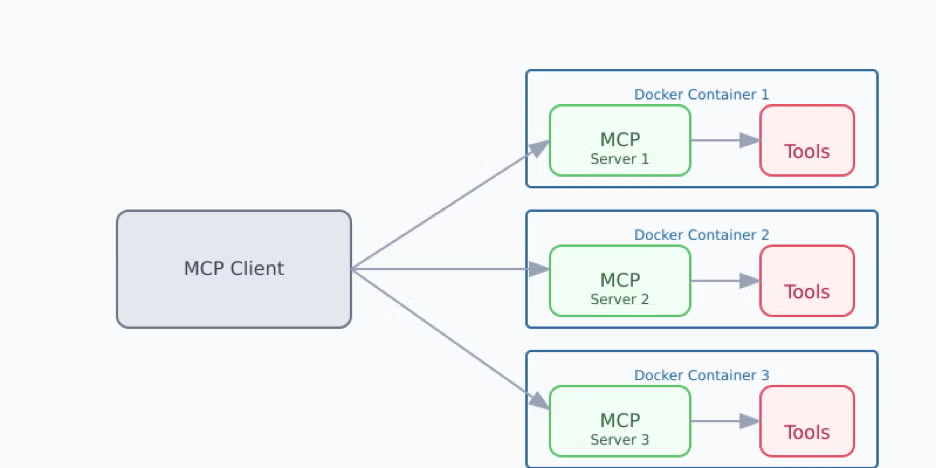

# Introduction

# MCP servers

# Gemini MCP Client

# Langchain-MCP

MCP Servers
- tools
- data
- prompts

MCP Client
- claude desktop client
- py client

App
- claude desktop app
- langGraph

# Docker
https://www.docker.com/blog/the-model-context-protocol-simplifying-building-ai-apps-with-anthropic-claude-desktop-and-docker/

# run

## mcp-client 
uv run client.py